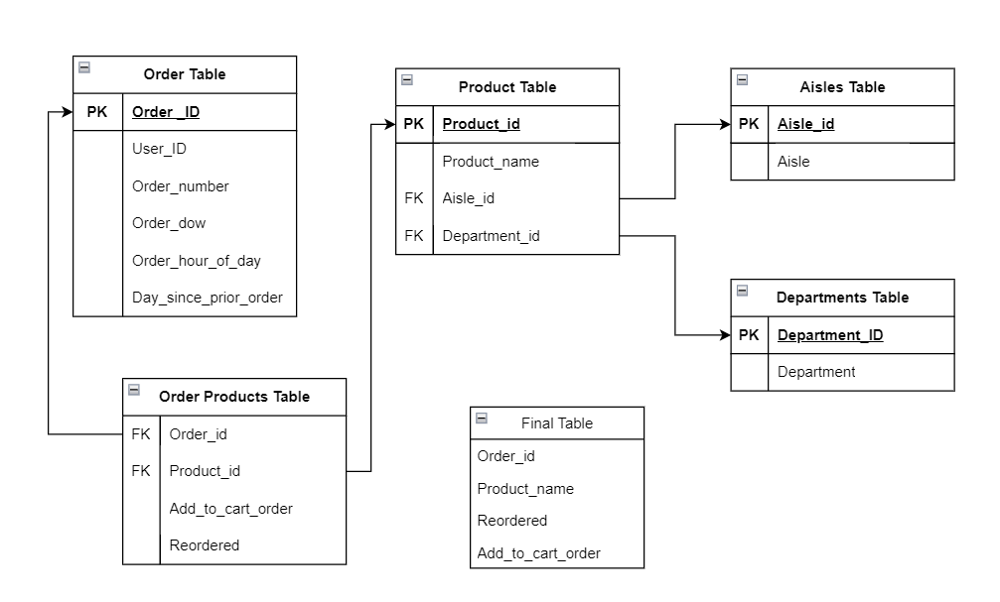

**E-Commerce Data Modelling and Analytics**

**Tech Stack:** PostgreSQL, Python

•	Performed exploratory data analysis on the Instacart dataset using Python, to understand consumer purchase patterns

•	Developed an E-commerce data model and established a PostgreSQL database to streamline analytics

•	Generated PostgreSQL tables with Python queries, streamlining data insertion using psycopg2 and sqlalchemy packages

•	Executed Analytic Queries in PostgreSQL to extract key insights on order frequencies, product popularity, and temporal shopping patterns

